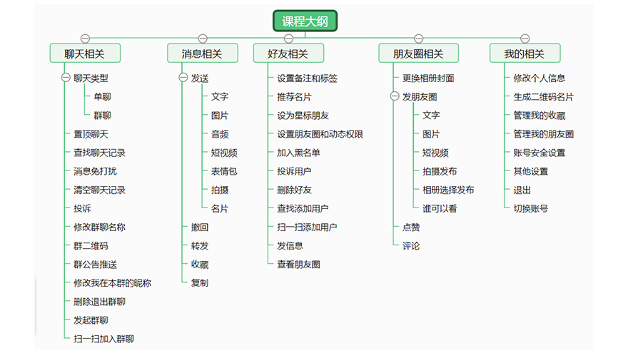
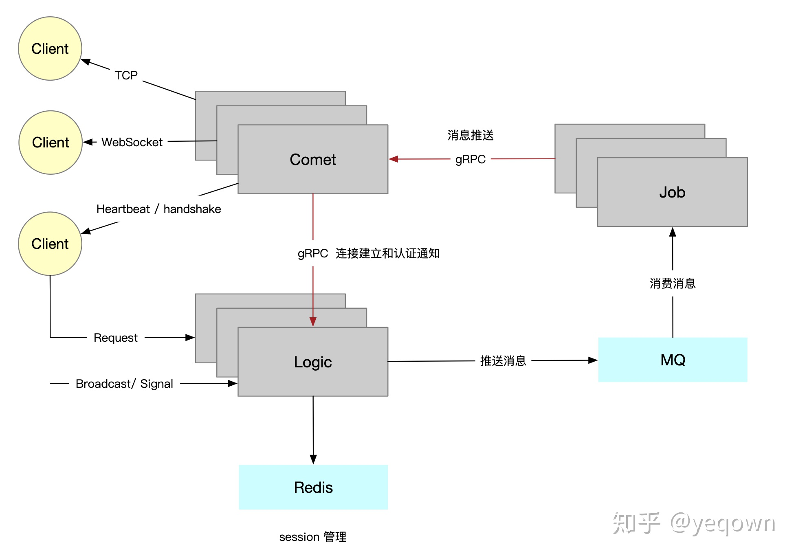

## 友情提示

> 1. **快速体验项目**：[在线访问地址](http://chat.example.com)。

## 项目介绍

`chat` 是一套仿微信ui的即时通讯全栈学习项目，项目出自 [uni-app实战仿微信app开发](https://study.163.com/course/introduction/1209487898.htm)
，已购买学习，于是用 `golang + vue` 微服务思想，重写了整个项目，主要功能点已实现


## 系统架构图

系统架构思想来源：goim 
- [项目地址](https://github.com/Terry-Mao/goim) [文章地址](https://zhuanlan.zhihu.com/p/128941542)


## 📗 目录结构

```lua
├── Makefile                     # 项目管理文件
├── admin                        # 管理后台
├── app                          # 业务目录
│   ├── logic                    # chat核心逻辑业务层
│   ├── connect                  # 连接层，管理http,ws,tcp连接
│   ├── constvar                 # 常量定义
│   ├── message                  # 消息队列消息定义
│   ├── task                     # 任务层,处理消息队列消息
├── cmd                          # 支持的命令
├── config                       # 配置文件统一存放目录
├── deploy                       # 部署相关
├── dict                         # 敏感词
├── docs                         # 框架相关文档
├── frontend                     # 前端界面
├── internal                     # 公共业务目录
├── logs                         # 存放日志的目录
├── pkg                          # 公共的 package
├── proto                        # 协议
└── target                       # 运行时目录
├── main.go                      # 项目入口文件
```

### 后端技术

- 脚手架 [snake](https://github.com/1024casts/snake)
- 消息推送架构 [goim](https://github.com/Terry-Mao/goim)
- 轻量级并发服务器框架 [zinx](https://github.com/aceld/zinx)
- http框架路由使用 [Gin](https://github.com/gin-gonic/gin) 路由
- grpc框架 [grpc](https://google.golang.org/grpc)
- consul服务注册中心 [consul](https://github.com/hashicorp/consul)
- websocket使用 [Websocket](https://github.com/gorilla/websocket)
- 中间件使用 [Gin](https://github.com/gin-gonic/gin) 框架的中间件
- 熔断器 [hystrix](github.com/afex/hystrix-go/hystrix)  
- 数据库组件 [GORM](https://gorm.io)
- 命令行工具 [Cobra](https://github.com/spf13/cobra)
- 文档使用 [Swagger](https://swagger.io/) 生成
- 配置文件解析库 [Viper](https://github.com/spf13/viper)
- 使用 [JWT](https://jwt.io/) 进行身份鉴权认证
- 校验器使用 [validator](https://github.com/go-playground/validator)  也是 Gin 框架默认的校验器
- 任务调度 [cron](https://github.com/robfig/cron)
- 包管理工具 [Go Modules](https://github.com/golang/go/wiki/Modules)
- 测试框架 [GoConvey](http://goconvey.co/)
- CI/CD [GitHub Actions](https://github.com/actions)
- 使用 [GolangCI-lint](https://golangci.com/) 进行代码检测
- 使用 make 来管理 Go 工程

### 管理后台
- laravel框架(5.5.*) [laravel文档](https://learnku.com/docs/laravel/5.5/installation/1282)
- laravel-admin后台框架 [laravel-admin文档](https://laravel-admin.org/)

### 前端技术
- 移动端 Vue 组件库 [vant](https://youzan.github.io/vant/#/zh-CN/)
- 脚手架 [vue-cli4 vant rem 移动端框架方案](https://github.com/sunniejs/vue-h5-template)

### 开发环境

| 工具           | 版本号 | 下载                                                            |
| ------------- | ------ | ------------------------------------------------------------ |
| golang        | 1.15   | https://golang.org/dl/                                       |
| nodejs        | 14.16  | https://nodejs.org/zh-cn/download/                           |
| php           | 7.3    | https://www.php.net/downloads.php                            |
| mysql         | 5.7    | https://www.mysql.com/                                       |
| redis         | 6.0    | https://redis.io/download                                    |
| nginx         | 1.19   | http://nginx.org/en/download.html                            |
| consul        | 1.9    | https://github.com/hashicorp/consul                          |
| protobuf      | 3.14   | https://github.com/protocolbuffers/protobuf                  |
| minio         | latest | http://docs.minio.org.cn/docs/                  |
| go-fastdfs    | latest | https://github.com/sjqzhang/go-fastdfs                  |

### 项目部署

### 手动编译部署

TIPS: 需要本地安装MySQL数据库和 Redis Consul go-fastdfs
```bash
# 下载安装
git clone 

# 进入项目目录
cd chat

# 编译
make build

# 修改配置
cd target/config

# 运行
make run
```

### docker

[docker安装文档](https://docs.docker.com/engine/install/)
```shell
cd chat
# 1. build image: 
docker build -t chat:latest -f Dockerfile .
# 2. start: 
docker run --rm -it -p 9050:9050 -p 9070:9070 chat:latest
# 启动时设置 --rm 选项，这样在容器退出时就能够自动清理容器内部的文件系统
```

### docker-compose
[docker-compose安装文档](https://docs.docker.com/compose/install/)
安装组件:
- chat_frontend 前端UI
- chat_connect 连接层，处理websocket,tcp连接
- chat_logic 核心逻辑业务层
- chat_task 任务层
- consul 服务注册中心
- db mysql数据库
- redis 缓存
- elasticsearch 全文搜索引擎  
- prometheus 服务监控
- node_exporter 本机监控指标收集至 prometheus
- grafana prometheus，loki数据展示
- loki 日志收集
- promtail loki agent
- jaeger 链路追踪
- fastdfs 资源服务器
- minio 私有对象存储

日志收集使用 loki + grafana + promtail [install](https://grafana.com/docs/loki/latest/installation/docker/)
- 安装loki的docker plugin
```shell
docker plugin install grafana/loki-docker-driver:latest --alias loki --grant-all-permissions
#当有新版本时, 更新plugins
docker plugin disable loki --force
docker plugin upgrade loki grafana/loki-docker-driver:latest --grant-all-permissions
docker plugin enable loki
systemctl restart docker

# 部署
cd chat
# 前端项目默认api host：127.0.0.1，如需修改，请 vim frontend/src/config/env.production.js
docker-compose up -d
```

访问 [http://127.0.0.1](http://127.0.0.1)

### 应用多开动态负载部署使用 nginx + consul-template
[文档地址](https://learn.hashicorp.com/tutorials/consul/load-balancing-nginx?in=consul/load-balancing)
- 注：chat-task任务层，默认使用redis发布订阅模式作为消息队列，如需多开请使用其他消息队列

## 常用命令

- make help 查看帮助
- make build 编译项目
- make run 运行项目
- make test 运行测试用例
- make clean 清除编译文件
- make doc 生成接口文档  
- make lint 代码检查
- make graph 生成交互式的可视化Go程序调用图
- make docker 生成docker镜像，确保已安装docker

## 📝 接口文档

- [chat接口文档](http://127.0.0.1:9050/swagger/index.html)
- [前端界面](http://127.0.0.1)
- [prometheus](http://127.0.0.1:9090)
- [grafana](http://127.0.0.1:3000)
- [jaeger](http://127.0.0.1:16686)
- [consul](http://127.0.0.1:8500)

## 其他

- 开发规范: [Uber Go 语言编码规范](https://github.com/xxjwxc/uber_go_guide_cn)
- Protobuf学习 [Protobuf学习](https://colobu.com/2019/10/03/protobuf-ultimate-tutorial-in-go/)
- Go微服务学习 [koala](https://github.com/ibinarytree/koala)
- Prometheus学习 [实战 Prometheus 搭建监控系统](https://www.aneasystone.com/archives/2018/11/prometheus-in-action.html)
- PromQL [初识 PromQL](https://fuckcloudnative.io/prometheus/3-prometheus/functions.html)
- ELK [ELK docker-compose install](https://github.com/deviantony/docker-elk)
- LOKI [loki](https://wsgzao.github.io/post/loki/)
- grafana dashboard [Linux主机详情](https://grafana.com/grafana/dashboards/12633)